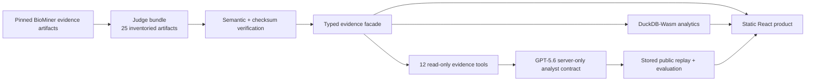

# TaxaLens

> Auditable biodiversity evidence from social media.

TaxaLens turns a messy trail of search terms, candidate photos, regional hypotheses, model routes,
and human-review gaps into one inspectable research workflow. It helps a researcher answer not only
“what might this be?” but also “why was it found, what evidence exists, what is missing, and what
must a human do next?”

**Status:** explicit prototype evidence mode · **Replay:** credential-free ·
**Hosting:** public static site · **Hero result:** awaiting human review

[Open the public judge replay](https://karikris.github.io/taxalens/)

## The problem

Social-media search can surface useful biodiversity candidates, but discovery metadata is not a
species label, a search hit is not an occurrence, and a model score is not taxonomic validation.
The evidence needed to review one candidate is usually scattered across query logs, duplicate
relationships, geography, visual routing, competing identities, references, and comments.

TaxaLens makes that chain visible. It preserves where every claim came from, distinguishes a
measured zero from unavailable work, and stops at the evidence boundary instead of filling gaps
with confident-looking output.

## Product preview

> **Preview placeholder:** a final competition screenshot or short product clip will be placed
> here. The hosted replay above is the current source of truth and can be reset at any time.

## Replay it locally

```bash
uv run taxalens demo replay --open
```

That one command validates the judge bundle and every checksum, builds the production web app,
serves it on loopback, waits for readiness, prints the TaxaLens and BioMiner SHAs plus bundle ID,
and opens the browser. It uses no Flickr, OpenAI, database, object-storage, model-download, GPU, or
cloud credential.

## Work and Productivity

TaxaLens is research decision support for evidence-heavy review work:

- **Plan before spending:** the Research Mission turns a question into a deterministic, budgeted
  evidence plan and shows missing prerequisites before any live work is approved.
- **Avoid repeated work:** the Observatory makes query deduplication, candidate unions, duplicate
  anti-joins, local-cache reads, and unavailable embedding reuse explicit rather than hiding them
  behind one pipeline status.
- **Review with context:** the Evidence Lens keeps discovery, geography, visual-input, competitor,
  reference, decision, and lifecycle evidence together without promoting any one signal into a
  scientific conclusion.
- **Prioritize the human handoff:** the Dashboard separates measured workload from unavailable
  scientific metrics and prepares six deterministic, provenance-bearing research outputs,
  including the explicit prototype boundary.
- **Explain without guessing:** the GPT-5.6 analyst reads the same verified evidence through bounded
  tools and is required to cite artifacts, disclose missing evidence, and reject unsupported claims.

The pilot does not claim measured time saved, accuracy gained, or fieldwork avoided. It demonstrates
how to make the work inspectable, repeatable, and safer to hand between researchers.

## What GPT-5.6 does

GPT-5.6 is central to the research workflow, not to species identification. The exact
`gpt-5.6-sol` contract uses the Responses API, strict Structured Outputs, explicit standard
reasoning, and 12 read-only evidence tools to plan research, inspect pipeline state, trace
lineage, compare available candidate evidence, explain unavailable decisions, and prepare exports.

The public Agent Trace shows only reviewable plans, tool parameters and results, citations,
structured output, budgets, and status. It never exposes hidden reasoning. The default judge path
replays one checksum-bound stored output and makes **no live model call**. Its deterministic
evaluation contains 30 tool cases plus the stored public replay, with 247 named checks; it is not a
scientific-accuracy benchmark.

GPT-5.6 does not decide that a Flickr candidate is *Papilio demoleus*, infer an occurrence, replace
human review, or manufacture a missing score, probability, competitor rank, reference, or image.

## Concise architecture



The public application is a static client over committed artifacts. It has no login or backend
dependency. The Python CLI verifies and serves the same production build locally; GitHub Pages
publishes it with an exact source SHA, static fallback, and SHA-256 file inventory.

## Honest pilot state

| Boundary | Verified pilot state |
| --- | --- |
| Target | *Papilio demoleus* (`gbif:1938069`) |
| Judge bundle | `papilio-demoleus-prototype-74a7d648-v3` |
| Product evidence | 25 inventoried artifacts, 20 sections, 29 section records |
| Discovery workload | 76,485 many-to-many query-hit associations and 13,501 canonical source-photo records |
| Prototype evidence | 81 / 81 user-confirmed as suitable for their assigned prototype roles, 0 independently taxonomically verified; B13 raw-margin policy; 13,496 of 13,501 staged records processed |
| Release gate | 14 / 14 prototype-entry gates pass; `GO_PROTOTYPE_ONLY` for explicit prototype mode |
| Product route | Research Mission, 13-stage Observatory, Evidence Lens, Human Review, Dashboard, Agent Trace, and six-step guided tour |
| Hero record | 1 candidate in `awaiting_human_review` |
| Media | 0 committed media items; no image or licensed thumbnail is fabricated |
| Visual and decision output | 0 YOLOE-processed images, 0 calibrated decisions, and no strongest-competitor rank |
| Scientific evaluation | independently reviewed precision, recall, calibration, and accuracy remain unavailable |
| Hosted replay | public, resettable, static, credential-free, and fingerprinted |

This is an honest product slice, not a finished global biodiversity platform. Candidate identities,
geographic clusters, and source-media leads are research workload. They are not confirmed
occurrences or classifications.

## The 90-second judge route

Start the guided tour in the app and follow:

1. **Research Mission** — inspect the deterministic target, policy, evidence budget, and blocked
   live actions.
2. **Observatory** — open the 13-stage pipeline, run the local DuckDB replay, and trace the final
   record back to its artifacts.
3. **Evidence Lens** — inspect discovery provenance, full-frame input contracts, regional
   candidates, uncertainty, and the unavailable calibrated decision.
4. **Human Review** — download the small checksum-verified Commons image cache, inspect each
   verification label, and record Yes, No, Can’t tell, Can’t view, or Skip with an optional comment.
5. **Dashboard** — review the evidence funnel, geographic workload, review priority, query yield,
   workflow efficiency, and blocked scientific evaluation.
6. **Export** — prepare and download six deterministic local research outputs, including the
   prototype boundary.

Use **Reset replay** to return to the initial state. The longer technical and limitation route is
in the [`JUDGE_GUIDE.md`](JUDGE_GUIDE.md); immutable implementation decisions are recorded under
[`docs/reports`](docs/reports/).

## TaxaLens and BioMiner

[BioMiner](https://github.com/karikris/BioMiner) is the evidence engine: it builds a trusted
butterfly identity registry, discovers Flickr metadata without duplicate requests, routes visual
evidence with YOLOE, and screens eligible images with BioCLIP. Its model output remains screening
evidence, never taxonomic validation.

TaxaLens is the product and audit surface over a bounded import of BioMiner contracts and committed
pilot artifacts. The source repository is pinned at
`74a7d648a562efa744e6502ef504a23b63b4e02f`; the judge replay never launches the BioMiner runtime.
The current GO decision authorizes only explicit prototype integration—not a production-default
change, scientific release, calibrated accuracy claim, or public display of the reference images.
The migration boundary and component-level provenance are documented in
[`UPSTREAM_BIOMINER.md`](UPSTREAM_BIOMINER.md) and
[`provenance/biominer_migration_manifest.yaml`](provenance/biominer_migration_manifest.yaml).

## Reproducibility and verification

Development requires Python 3.11 or newer and uv 0.11 or newer. The local replay installs locked
web dependencies only when they are absent. To prepare the complete development environment:

```bash
uv sync --locked
cd apps/web && npm ci
```

The principal verification commands are:

```bash
uv run --locked pytest
uv run --locked python scripts/import_biominer_prototype_artifacts.py --check
uv run --locked python scripts/import_biominer_analytics.py --check
uv run --locked python scripts/verify_demo.py
uv run --locked python scripts/verify_provenance.py
cd apps/web && npm test
cd apps/web && npm run check
cd apps/web && npm run verify:build
cd apps/web && npm run test:e2e
```

Every hosted build publishes
[`build-fingerprint.json`](https://karikris.github.io/taxalens/build-fingerprint.json). The manifest
binds the deployed source commit and Pages base path to the byte count and SHA-256 digest of every
other deployed file. The truthful fixture entry point is
[`demo/fixture/papilio_pilot/judge_bundle.json`](demo/fixture/papilio_pilot/judge_bundle.json).

## Repository map

| Path | Purpose |
| --- | --- |
| `taxalens/` | Python CLI, product facade, verification, and local replay server |
| `apps/web/` | Static React judge product, tests, and deployment builder |
| `demo/fixture/papilio_pilot/` | Closed checksum-verified judge fixture |
| `packages/replay/` | Compact replay contracts imported from pinned BioMiner provenance |
| `provenance/` | Migration, GitHits, source-boundary, and repository-state evidence |
| `docs/reports/` | Immutable phase decisions, tests, limitations, and handoffs |
| `submission/` | Judge-facing AI and code-provenance evidence |

## License

TaxaLens is available under the [MIT License](LICENSE).
