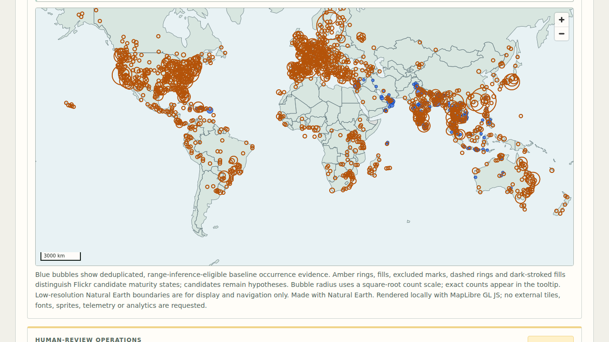
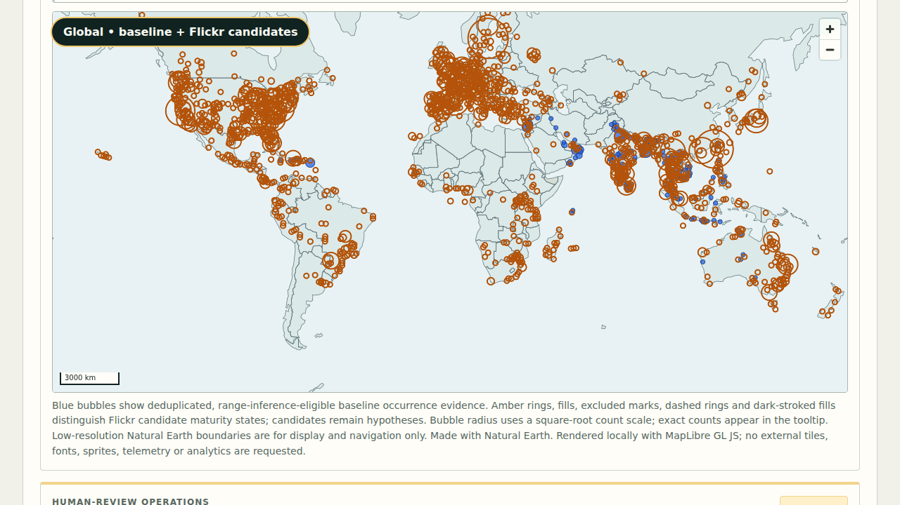
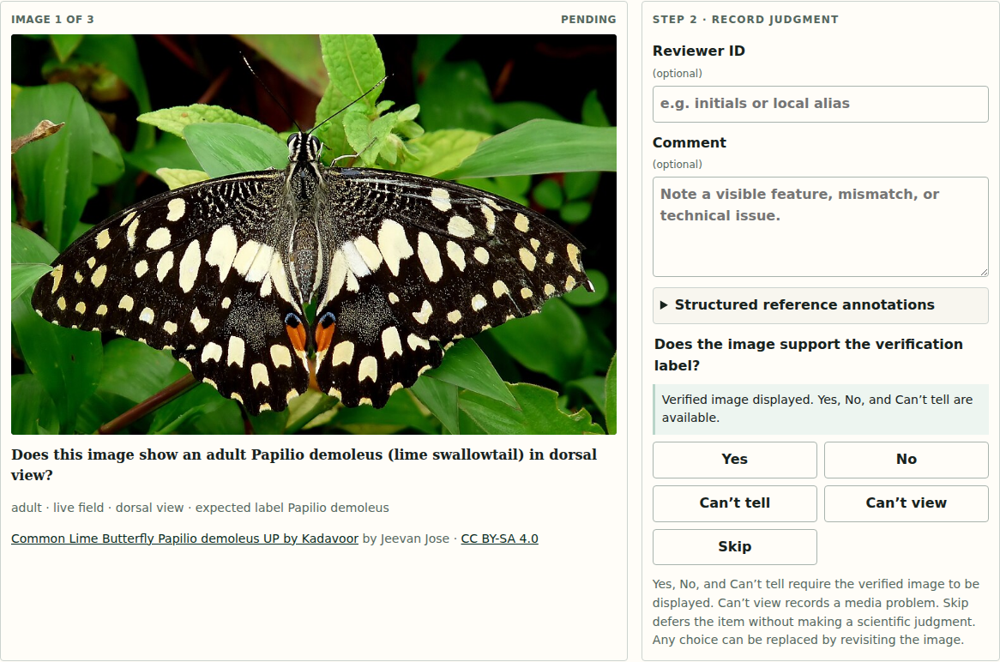
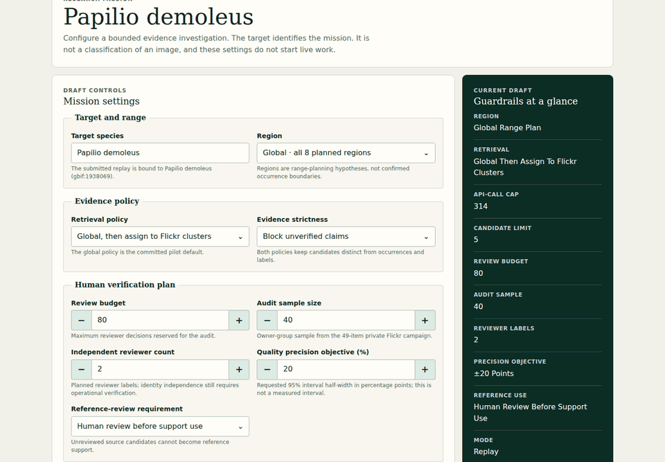
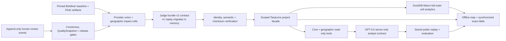

# TaxaLens

> Auditable biodiversity evidence from social media.

TaxaLens turns a messy trail of search terms, candidate photos, regional hypotheses, model routes,
and human-review gaps into one inspectable research workflow. It helps a researcher answer not only
“what might this be?” but also “why was it found, what evidence exists, what is missing, and what
must a human do next?”

**Status:** explicit prototype evidence mode · **Replay:** credential-free ·
**Hosting:** public static site · **Hero result:** awaiting human review

[Open the public judge replay](https://karikris.github.io/taxalens/)

## The problem

Social-media search can surface useful biodiversity candidates, but discovery metadata is not a
species label, a search hit is not an occurrence, and a model score is not taxonomic validation.
The evidence needed to review one candidate is usually scattered across query logs, duplicate
relationships, geography, visual routing, competing identities, references, and comments.

TaxaLens makes that chain visible. It preserves where every claim came from, distinguishes a
measured zero from unavailable work, and stops at the evidence boundary instead of filling gaps
with confident-looking output.

## Product preview



This is the real 1280×720 Chromium regression capture from the credential-free replay. At the
global resolution-3 scope, the pinned artifacts reconcile 2,155 spatial cells, 19,201 deduplicated
baseline observations, 13,416 geographically supported Flickr candidates, and 1,221 potential
coverage-gap cells. The retained campaigns currently contain **zero human-supported additional
cells and zero release-ready occurrence candidates**; the amber rings are hypotheses awaiting
review, not new occurrence records.



The seven-frame journey is generated from the same fixed-time local production build. Its
human-reviewed frame deliberately renders the exact zero retained outcomes; the animation does not
invent a review, release decision, or occurrence claim.

### Human-verification preview



The screenshot is an actual local production-build capture after preparing the three-image Commons
cache. It is a workflow fixture, not a taxonomic result for the Flickr hero candidate.



### Verification workflow

1. **Plan** a review budget, audit sample, reviewer count, precision objective, and reference gate in
   Research Mission.
2. **Inspect** one source and its unavailable evidence in Evidence Lens, then choose **Verify this
   result**.
3. **Prepare** the small rights-cleared local cache and review one displayed image and label at a
   time.
4. **Record** Yes, No, Can’t tell, Can’t view, or Skip with an optional comment. Events are
   append-only in local IndexedDB until export.
5. **Read** current campaign-policy consensus, event lineage, decisive coverage, conflicts,
   reference readiness, and the next review milestone.

The exact Flickr result currently has no committed review image. Its route therefore opens the
separate actionable Commons workflow with an explicit warning: those fixture decisions do not
verify the Flickr source.

### Measured impact, tightly bounded

One matched **scripted Chromium** pair over the same three-item task recorded 20 actions in the
manual protocol and 10 in the TaxaLens-assisted protocol—a 50% reduction in scripted interaction
count. The assisted browser run was slower in elapsed execution time (2,752 ms versus 753 ms).
There were zero human participants, so human time saved, human productivity, scientific quality
change, and population savings remain unavailable.

### Honest quality state

The target-precision interval is **unavailable**: zero inclusion-weighted decisive Flickr audit
outcomes are committed. The first checkpoint is 20 decisive outcomes. BioMiner separately records
81 / 81 provider-supported records as user-confirmed suitable for their assigned prototype roles;
that is not independent human taxonomic verification and does not unlock reference readiness.

## Replay it locally

```bash
uv run taxalens demo replay --open
```

That one command validates the judge bundle and every checksum, builds the production web app,
serves it on loopback, waits for readiness, prints the TaxaLens and BioMiner SHAs plus bundle ID,
and opens the browser. It uses no Flickr, OpenAI, database, object-storage, model-download, GPU, or
cloud credential.

The optional cloud data boundary is also committed as a deterministic
[`repository storage mirror`](demo/repository_storage/README.md): six Supabase table snapshots
cover four campaigns and 82 items, while a checksum-addressed Backblaze B2 object manifest covers
every committed source and judge-fixture object. Mutable reviewer tables remain empty rather than
inventing users or decisions, and Flickr/GBIF/iNaturalist source-image collections remain
metadata-only under the repository rights policy.

## Work and Productivity

TaxaLens is research decision support for evidence-heavy review work:

- **Plan before spending:** the Research Mission turns a question into a deterministic, budgeted
  evidence plan and shows missing prerequisites before any live work is approved.
- **Avoid repeated work:** the Observatory makes query deduplication, candidate unions, duplicate
  anti-joins, local-cache reads, and unavailable embedding reuse explicit rather than hiding them
  behind one pipeline status.
- **Review with context:** the Evidence Lens keeps discovery, geography, visual-input, competitor,
  reference, decision, and lifecycle evidence together without promoting any one signal into a
  scientific conclusion.
- **Prioritize the human handoff:** the Dashboard separates measured workload from unavailable
  scientific metrics and prepares six deterministic, provenance-bearing research outputs,
  including the explicit prototype boundary.
- **Explain without guessing:** the GPT-5.6 analyst reads the same verified evidence through bounded
  tools and is required to cite artifacts, disclose missing evidence, and reject unsupported claims.

The pilot does not claim measured human time saved, accuracy gained, or fieldwork avoided. It
demonstrates a measured reduction in one scripted action count and shows how to make the work
inspectable, repeatable, and safer to hand between researchers.

## What GPT-5.6 does

GPT-5.6 is central to the research workflow, not to species identification. The exact
`gpt-5.6-sol` contract uses the Responses API, strict Structured Outputs, explicit standard
reasoning, 12 core read-only evidence tools, and six deterministic geographic tools to plan
research, inspect pipeline state, trace lineage, compare available candidate evidence, explain
unavailable decisions, and prepare exports.

The public Agent Trace shows only reviewable plans, tool parameters and results, citations,
structured output, budgets, and status. It never exposes hidden reasoning. The default judge path
replays checksum-bound stored outputs and makes **no live model call**. The geographic evaluation
adds 24 cases for provider double counting, maturity, data deficiency, release gates, citations,
terminology, and model-memory arithmetic; it is not a scientific-accuracy benchmark.

GPT-5.6 does not decide that a Flickr candidate is *Papilio demoleus*, infer an occurrence, replace
human review, or manufacture a missing score, probability, competitor rank, reference, or image.

## Concise architecture



The public application is a static client over committed artifacts. It has no login or backend
dependency. The Python CLI verifies and serves the same production build locally; GitHub Pages
publishes it with an exact source SHA, static fallback, and SHA-256 file inventory.

### Geographic evidence contract

- **Blue** means deduplicated baseline occurrence evidence. The committed union contains 19,201
  canonical observations: 4,017 GBIF-only and 15,184 iNaturalist-origin observations delivered
  through GBIF. A direct iNaturalist snapshot is unavailable, so its delta is unavailable—not zero.
- **Amber** means Flickr candidate evidence. Hollow rings are unreviewed hypotheses; fill, exclusion
  marks, dashed strokes, and dark release strokes distinguish later maturity without relying on
  colour alone.
- A **candidate-only spatial cell** has Flickr candidates but no evidence in the selected baseline
  snapshot. It represents potential coverage contribution, never proof of biological absence.
- A **human-supported additional cell** requires retained target-positive review. A
  **release-ready occurrence candidate** additionally requires every coordinate, duplicate,
  quality, provenance, consensus, and occurrence-release gate.
- Missing or unsuitable baseline evidence remains an explicit data-deficiency state. Skip and
  Can’t view never add reviewed evidence.

## Honest pilot state

| Boundary | Verified pilot state |
| --- | --- |
| Target | *Papilio demoleus* (`gbif:1938069`) |
| Judge bundle | `papilio-demoleus-prototype-74a7d648-v3` |
| Product evidence | 30 inventoried artifacts; the stored v1 replay retains 25 sections and 36 section records, while the verified loader migrates it to the v2 contract without inventing geographic sections |
| Discovery workload | 76,485 many-to-many query-hit associations and 13,501 canonical source-photo records |
| Baseline provider union | 19,201 canonical observations; 0 cross-provider duplicates removed in this snapshot; 0 unresolved provider groups; direct iNaturalist delta unavailable |
| Geographic Impact | Resolution 3: 2,155 full-outer cells, 13,416 geographically supported Flickr candidates, and 1,221 potential coverage-gap cells |
| Geographic maturity | 0 retained human-reviewed Flickr outcomes, 0 human-supported additional cells, and 0 release-ready occurrence candidates |
| Prototype evidence | 81 / 81 user-confirmed as suitable for their assigned prototype roles, 0 independently taxonomically verified; B13 raw-margin policy; 13,496 of 13,501 staged records processed |
| Release gate | 14 / 14 prototype-entry gates pass; `GO_PROTOTYPE_ONLY` for explicit prototype mode |
| Product route | Research Mission, 13-stage Observatory, Evidence Lens with record mini-map, Verification, Flickr Workload Map, Geographic Impact Lens, Dashboard, Agent Trace, and six-step guided tour |
| Hero record | 1 candidate in `awaiting_human_review` |
| Media | 3 licensed Commons review images; the discovery replay and hero record still admit 0 scientific images |
| Visual and decision output | 0 YOLOE-processed images, 0 calibrated decisions, and no strongest-competitor rank |
| Scientific evaluation | independently reviewed precision, recall, calibration, and accuracy remain unavailable |
| Hosted replay | public, resettable, static, credential-free, and fingerprinted |

This is an honest product slice, not a finished global biodiversity platform. Candidate identities,
geographic clusters, and source-media leads are research workload. They are not confirmed
occurrences or classifications.

## The 90-second judge route

Use the numbered product navigation:

1. **Mission** — inspect the deterministic human-verification plan and its planning objective.
2. **Evidence Lens** — inspect `flickr:55081300254`, then choose **Verify this result**.
3. **Verify Flickr** — confirm the exact result has no displayable committed media and cannot be
   labelled; the actionable Commons cache is explicitly separate.
4. **Verify references** — check the empty public GBIF and iNaturalist routes, return to **All**,
   prepare the rights-cleared cache, and record one workflow decision.
5. **Watch quality** — see decisive campaign coverage change while reference readiness remains
   0 / 24 and the target-precision interval remains unavailable.
6. **Ask GPT-5.6** — inspect its stored, validated adjudication recommendation for a synthetic
   conflicted control, clearly separated from current browser state.
7. **Export** — prepare six checksum-bearing local research outputs, including the prototype
   boundary.

Use **Reset replay** to return to the initial state. The built-in guided tour is a slower
orientation route. Exact timings, expected states, technical checks, and limitations are in
[`JUDGE_GUIDE.md`](JUDGE_GUIDE.md); immutable implementation decisions are recorded under
[`docs/reports`](docs/reports/).

The browser packet, bundle campaign and item artifacts, asset verifier, and fixture builder all
load the canonical
[`Papilio demoleus` verification manifest](demo/source/verification/papilio-demoleus-commons.campaign.json).

## TaxaLens and BioMiner

[BioMiner](https://github.com/karikris/BioMiner) is the evidence engine: it builds a trusted
butterfly identity registry, discovers Flickr metadata without duplicate requests, routes visual
evidence with YOLOE, and screens eligible images with BioCLIP. Its model output remains screening
evidence, never taxonomic validation.

TaxaLens is the product and audit surface over a bounded import of BioMiner contracts and committed
pilot artifacts. The current verification-planning source repository is pinned at
`94fa1f634ee3c63917c05d78181dd3cf9ceff940`; the judge replay never launches the BioMiner runtime.
The current GO decision authorizes only explicit prototype integration—not a production-default
change, scientific release, calibrated accuracy claim, or public display of the reference images.
The migration boundary and component-level provenance are documented in
[`UPSTREAM_BIOMINER.md`](UPSTREAM_BIOMINER.md) and
[`provenance/biominer_migration_manifest.yaml`](provenance/biominer_migration_manifest.yaml).

## Reproducibility and verification

Development requires Python 3.11 or newer and uv 0.11 or newer. The local replay installs locked
web dependencies only when they are absent. To prepare the complete development environment:

```bash
uv sync --locked
cd apps/web && npm ci
```

The principal verification commands are:

```bash
uv run --locked pytest
uv run --locked python scripts/import_biominer_prototype_artifacts.py --check
uv run --locked python scripts/import_biominer_analytics.py --check
uv run --locked python scripts/build_repository_storage.py --check
uv run --locked python scripts/verify_demo.py
uv run --locked python scripts/verify_provenance.py
cd apps/web && npm test
cd apps/web && npm run check
cd apps/web && npm run verify:build
cd apps/web && npm run test:e2e
```

Every hosted build publishes
[`build-fingerprint.json`](https://karikris.github.io/taxalens/build-fingerprint.json). The manifest
binds the deployed source commit and Pages base path to the byte count and SHA-256 digest of every
other deployed file. The truthful fixture entry point is
[`demo/fixture/papilio_pilot/judge_bundle.json`](demo/fixture/papilio_pilot/judge_bundle.json).

## Repository map

| Path | Purpose |
| --- | --- |
| `taxalens/` | Python CLI, product facade, verification, and local replay server |
| `apps/web/` | Static React judge product, tests, and deployment builder |
| `demo/fixture/papilio_pilot/` | Closed checksum-verified judge fixture |
| `demo/repository_storage/` | Credential-free Supabase snapshots and B2 object inventory |
| `packages/replay/` | Compact replay contracts imported from pinned BioMiner provenance |
| `provenance/` | Migration, GitHits, source-boundary, and repository-state evidence |
| `docs/reports/` | Immutable phase decisions, tests, limitations, and handoffs |
| `submission/` | Judge-facing AI and code-provenance evidence |

## License

TaxaLens is available under the [MIT License](LICENSE).
